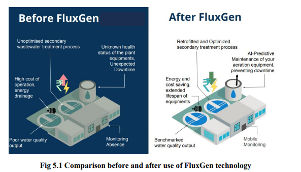

# Project Title

# Water Positive Intelligence: AI-Driven Monitoring & Efficiency

## Project Description
This presentation provides a comprehensive overview of the project “Water Positive Intelligence: AI-Driven Monitoring & Efficiency.” It covers the problem of industrial water scarcity and introduces an IoT- and AI-powered solution designed to improve real-time monitoring, anomaly detection, automated reporting, and sustainability tracking. The file includes the system architecture, methodologies, implementation details, results, key learnings, and future scope of the project undertaken during the Major Project-I evaluation for AY 2025–26.

## Folder Structure

IG05/
│
├── README.md
├── Report/
│   └── IG05.pdf
├── Power Point/
│   └── IG05.pptx
├── Diagrams/
│   ├── End-to-End Water Intelligence Architecture.png
│   ├── Key Testing Areas and Validation Metrics.png
│   └── Operational Modules Diagram.png
├── Result/
│   ├── Comparison before and after use of FluxGen technology.png
└── Video/
    └── IG05.mp4

## Results

### 1. Improved Data Reliability — Before & After

## Video Demonstration

The repository includes a 5-minute demonstration video summarising the project, covering:

- Problem overview
- Feature workflows
- Implementation
- Key contributions and outcomes

You can find it here:
[Click to View Video](Video/IG05.mp4)

## Included Files

- Major Project Report (PDF)
- End-Term Presentation (PPTX)
- Before/After Result Visualization
- System & Logic Diagrams (PNG)
- 5-Minute Demonstration Video

 
